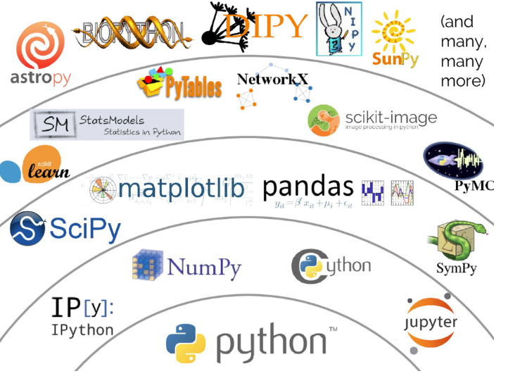
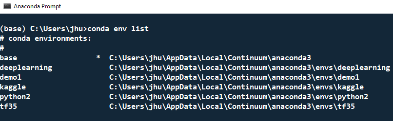
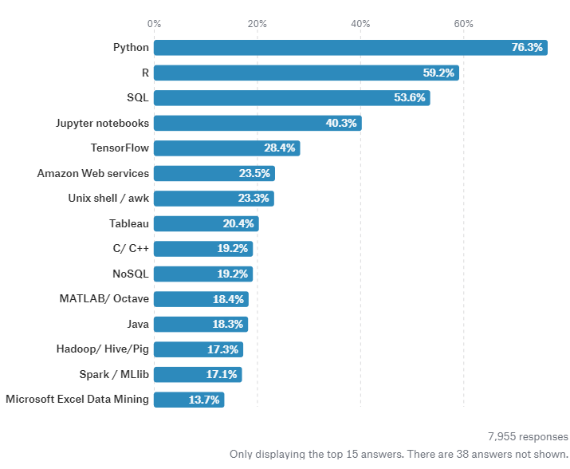

```{r setup, include=FALSE}
options(htmltools.dir.version = FALSE)
```


class: inverse, center, middle

# Disclaimer

---

# A Personal Journey to SAS, R and Python

* Started to learn SAS at graduate school in 2006  

* I then worked for SAS, Sanofi and d-Wise  

* blogging at http://jiangtanghu.com/blog/  

---
# A Personal Journey to SAS, R and Python


* Start to learn R in 2009

* Still a frequent R user 
  + blogging
  + slides
  + course works
  + sometimes in professional work

---
# A Personal Journey to SAS, R and Python

* Start to learn Python in 2014

* Still a learner!
  + MOOCs (machine learning/deep learning)
  + pioneering work (deep learning in Clinical world?)
  + occasionally in professional work


---

# R is comming to clinical


--
- R is well known in statistical departments
--


- long time language battle between SAS and R
--

- Some biostatisticians in pharma use R  

--

- Some FDA statistical reviewers use R

--


---
# Python

 

> Python is not a statistic computing language!


> and this may be its greatest strength as a language for statistical computing. <sup>*</sup>


.footnote[[*] Python's Data Science Stack by Jake VanderPlas, JSM 2016 ]


---

# Language Design

Python is simply a better language.


---
# Language Design: R

--
Ross Ihaka: problems with current R systems <sup>*</sup>

--
* Tree-walking interpreters: no optimisation, inherently slow

--

* Call-by-value semantic: Produces vast amounts of data copying
   + the design matrix is copied 6 times during the linear model fitting process
--
   
.footnote[[*] Ross Ihaka: Towards a New Statistical Computing System, JSM 2014 ]
---
# Language Design: R

Solution #1: Radical  

* Ross Ihaka: new software!  <sup>*</sup>

.footnote[[*] Ross Ihaka: Towards a New Statistical Computing System, JSM 2014 ]

---
# Language Design: R

Solution #2: system-wise modification

* renjin, is a JVM based R interpreter (developed by Alexander Bertram)

* Microsoft R Open

* TIBCO Enterprise Runtime for R

* ...
---

# Language Design: R

Solution #3: package-wise optimization

* Hadley Wickham: tidyverse


---


# Language Design: Python

Python 2 vs Python 3

* Text and binary data in Python 2 are a mess

* Python 3 started at 2008 
   + backwards-incompatible change!
   
* Python 2 will end at Jan 1, 2020


---


# Ecosystem: R

Although facing fundamental drawbacks in core design, 

R enjoys huge success due to its user contributed packages.


---
# Ecosystem: R

One of the problems of R ecosystem is 

most packages are one-person-project

* Hadley Wickham: tidyverse


---

# Ecosystem: R

One of the problems of R ecosystem is 

most packages are one-person-project

* Hadley Wickham: tidyverse 

--

  +  https://github.com/tidyverse/ggplot2   
  +  https://github.com/matplotlib/matplotlib    
  
--
    
  +  https://github.com/tidyverse/dplyr  
  +  https://github.com/pandas-dev/pandas  

--

---

# Ecosystem: R

One of the problems of R ecosystem is 

most packages are (pure, isolated) collection of functions

* E1071


---

# Ecosystem: Python





---

# System Integration


--
R is a free software environment for statistical computing and graphics.  


--

Python is a general-purpose programming language:
  * data sciences
  * web frameworks
  * system administration
  * networking, automation, databases, ...

--


---

# System Integration
Conda: Package, dependency and environment management


---
# Back to the Future

Python is the first-class citizen in the world of 

* big data

* artificial intelligence

* machine learning

* deep learning 

* ...


---

# Kaggle: The State of ML and Data Science 2017 <sup>*</sup>

Python was the most commonly used data analysis tool across employed data scientists overall, but more Statisticians are still loyal to R.




.footnote[[*] https://www.kaggle.com/surveys/2017 ]

---

class: inverse, center, middle
# Thanks! <sup>*</sup>


Jiangtang('JT') Hu 

d-Wise

jiangtanghu.com/blog


